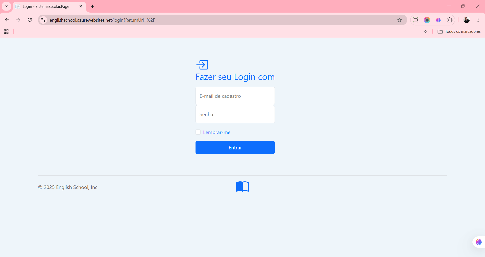
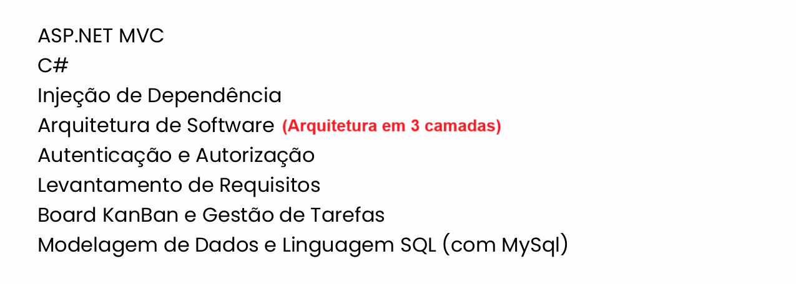
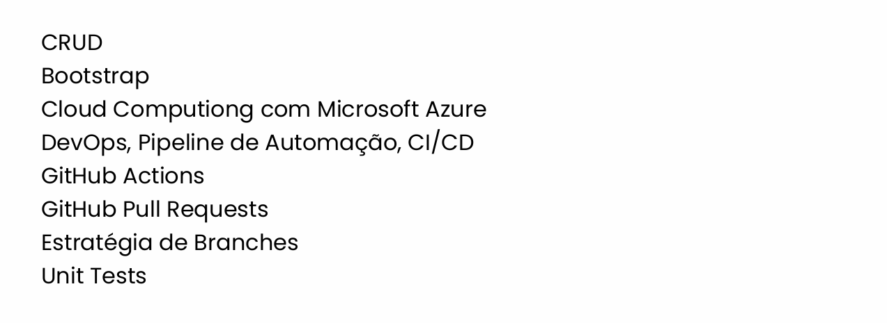

# 💼 Projeto – Visão Geral

  

## 📸 Prévia do Sistema

  
    
  

---

## 🧩 Sobre o Projeto
Este repositório apresenta uma solução desenvolvida com foco em organização, performance e boas práticas.  
As imagens acima demonstram partes do fluxo e da interface do sistema.

---

## 🌐 Conecte-se Comigo

<table>
  <tr>
    <td><strong>LinkedIn</strong></td>
    <td><a href="www.linkedin.com/in/mauricio-campos-dev-full-stack" target="_blank">Acessar Perfil</a></td>
  </tr>
  <tr>
    <td><strong>WhatsApp</strong></td>
    <td><a href="https://wa.me/5512991020922" target="_blank">Enviar Mensagem</a></td>
  </tr>
  <tr>
    <td><strong>Notion</strong></td>
    <td><a href="https://www.notion.so/276051526fff80e1aa1fd222916c13fd?v=276051526fff81f0972f000c21386f34&source=copy_link" target="_blank">Ver Arquitetura</a></td>
  </tr>
</table>

