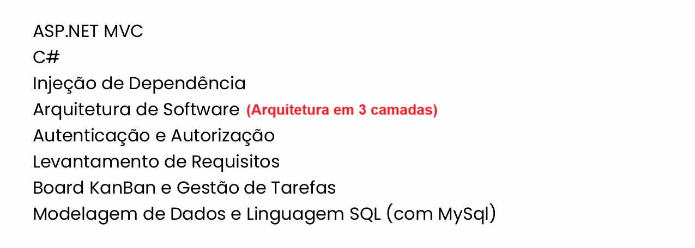
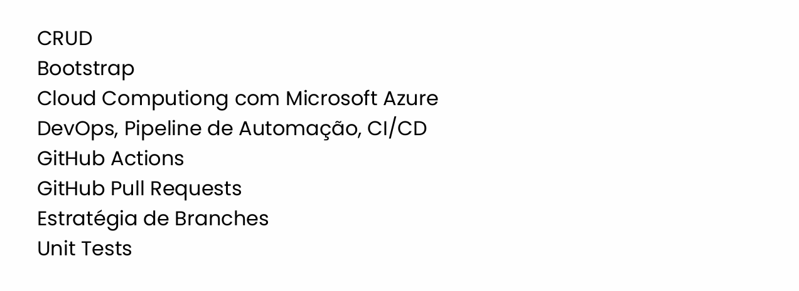

# 💼 Projeto – Visão Geral

## 📸 Prévia do Sistema

  
    
  

---

## 🧩 Sobre o Projeto
Este repositório apresenta uma solução desenvolvida com foco em organização, performance e boas práticas.  
As imagens acima demonstram partes do fluxo e da interface do sistema.

---

# 📘 Detalhamento de Requisitos

## 🎯 Objetivo Geral
Construir um sistema de gestão para a escola **EnglishSchool**, com acesso restrito a administradores, professores e alunos, utilizando **login e senha**.  
Cada perfil possui funcionalidades específicas, garantindo segurança e organização no processo de gestão acadêmica.

---

## 📝 Objetivos Específicos

- Garantir acesso seguro por meio de credenciais (login e senha).
- Permitir que **administradores** cadastrem:
  - Turmas  
  - Professores  
  - Alunos  
- Permitir que **professores** registrem notas e faltas de seus alunos.
- Permitir que **alunos** consultem suas notas e faltas de maneira rápida e objetiva.

### 🧑‍🏫 Cadastro de Usuários

- **Aluno**  
  - Nome  
  - Email  

- **Professor**  
  - Nome  
  - Email  

---

## 📏 Regras de Negócio

- As turmas são **semestrais**.  
  - Exemplo: *2ºsem/2024*

- As turmas possuem **níveis**:  
  - Básico  
  - Intermediário  
  - Avançado  

- As turmas possuem **períodos**.  
  - Exemplo: *terça e quinta 19h*, *sábado 9h*, *segunda e quarta 15h*

- As provas são **bimestrais**, com notas de **0 a 10**.

- Cada aluno faz **3 provas**:
  - Leitura  
  - Escrita  
  - Conversação  

- **Nota Final do Bimestre** = média das 3 provas  
- **Nota Final do Semestre** = média dos dois bimestres

- Critérios:
  - Nota final < 6 → **Reprovado**  
  - Nota final ≥ 6 → **Aprovado**

---

## 📚 Exemplo Ilustrativo

**Turma:** Nível Básico – 2ºsem/2024, Segunda e Quinta, 15:45  
**Professor:** Maria Antônia  
**Alunos:**

---

### 👤 José Almeida da Silva

**1º Bimestre**  
- Leitura: 6  
- Escrita: 8  
- Conversação: 10  
- **Nota Final:** 8  

**2º Bimestre**  
- Leitura: 2  
- Escrita: 4  
- Conversação: 6  
- **Nota Final:** 4  

**Nota Final do Semestre:** **6 — Aprovado**

---

### 👤 Ana Luiza

**1º Bimestre**  
- Leitura: 5  
- Escrita: 4  
- Conversação: 3  
- **Nota Final:** 4  

**2º Bimestre**  
- Leitura: 2  
- Escrita: 4  
- Conversação: 6  
- **Nota Final:** 4  

**Nota Final do Semestre:** **4 — Reprovado**

---

# 🧩 Funcionalidades e Perfis de Acesso

## 👨‍💼 Administrador

- Acesso restrito via login e senha  
- Gerenciar professores:
  - Inserir  
  - Visualizar  
  - Editar  
  - Excluir  
  - Dados: **nome completo, email, login, senha**
- Gerenciar alunos:
  - Inserir  
  - Visualizar  
  - Editar  
  - Excluir  
  - Dados: **nome completo, email, login, senha**
- Gerenciar turmas:
  - Inserir  
  - Visualizar  
  - Editar  
  - Excluir  
  - Dados: professor, semestre, ano, nível, período
- Associar e desassociar alunos às turmas
- Visualizar **notas e faltas** de todos os alunos em todas as turmas

---

## 👨‍🏫 Professor

- Acesso restrito via login e senha  
- Visualizar suas turmas e respectivos alunos  
- Registrar **notas e faltas** dos seus alunos  

---

## 👨‍🎓 Aluno

- Acesso restrito via login e senha  
- Visualizar:
  - Turmas atuais  
  - Histórico de turmas  
  - Suas notas e faltas  

---

## 🔗 Ambiente Online para Testes

### Acesse o sistema hospedado no Azure:
➡️ **https://englishschool.azurewebsites.net/login**
##### Ps.: Com o botão direito do mouse, opte por "Abrir link num novo separador" #####

---

**Login do Administrador:**  
- Usuário: **admin**  
- Senha: **123**

### ⚠️ Observação Importante
- Caso, ao logar **(Pode ser que demore cerca de 28 milesegundos para o servidor provocar a página de erro)**, apareça mensagem de **expiração**, clique em **Sair** e faça login novamente.  
- Isso ocorre porque está habilitado o modo **Serverless hibernável do Azure**, para evitar cobranças, mesmo utilizando o **SQL Server gratuito (Que por padrão já hiberna automaticamente)** do Azure.

---

## 🧪 Como Testar o Sistema no Ambiente Online

### 👨‍💼 Teste como Administrador
1. Logar como **Admin**.  
2. Testar o CRUD completo de:  
   - Alunos  
   - Professores  
   - Turmas  
   - Boletim  
3. Criar um **Professor**.  
4. Criar um **Aluno**.  
5. Criar uma **Turma**.  
6. Associar um **Aluno** à Turma.  
   - Não lance notas e faltas (Deixe isso para o professor).

---

### 👨‍🏫 Teste como Professor
1. Sair do sistema.  
2. Logar como **Professor** criado anteriormente.  
3. Visualizar suas:  
   - Turmas  
   - Alunos  
4. Acessar o **Boletim** de um aluno e lançar:  
   - Notas  
   - Faltas  
5. O sistema calculará automaticamente:  
   - Média do bimestre  
   - Média do semestre  
   - Aprovação/Reprovação

---

### 👨‍🎓 Teste como Aluno
1. Sair do sistema.  
2. Logar como **Aluno** criado anteriormente.  
3. Visualizar:  
   - Seus dados  
   - Sua turma  
   - Seu boletim  
   - Suas notas e faltas

---

### 🗑️ Finalizando os Testes
Ao final, faça o processo de exclusão na ordem correta:

1. Logar novamente como **Admin**.  
2. Excluir na seguinte ordem na **Turma** criada:  
   - **Alunos da Turma**  
   - **Turma**  
   - **Professor**  
   - **Aluno**

# 🌐 Conecte-se Comigo

<table>
  <tr>
    <td><strong>LinkedIn</strong></td>
    <td><a href="www.linkedin.com/in/mauricio-campos-dev-full-stack" target="_blank">Acessar Perfil</a></td>
  </tr>
  <tr>
    <td><strong>WhatsApp</strong></td>
    <td><a href="https://wa.me/5512991020922" target="_blank">Enviar Mensagem</a></td>
  </tr>
  <tr>
    <td><strong>App Notion</strong></td>
    <td><a href="https://www.notion.so/276051526fff80e1aa1fd222916c13fd?v=276051526fff81f0972f000c21386f34&source=copy_link" target="_blank">Ver Arquitetura do Projeto</a></td>
  </tr>
  <tr>
    <td><strong>Meu Site Pessoal</strong></td>
    <td><a href="https://site-mauricio-campos.vercel.app/" target="_blank">Acessar Site</a></td>
  </tr>
</table>

---
